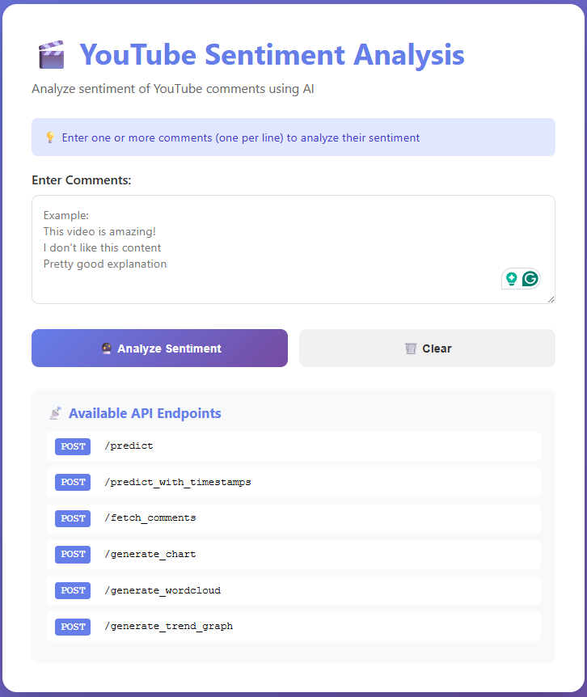
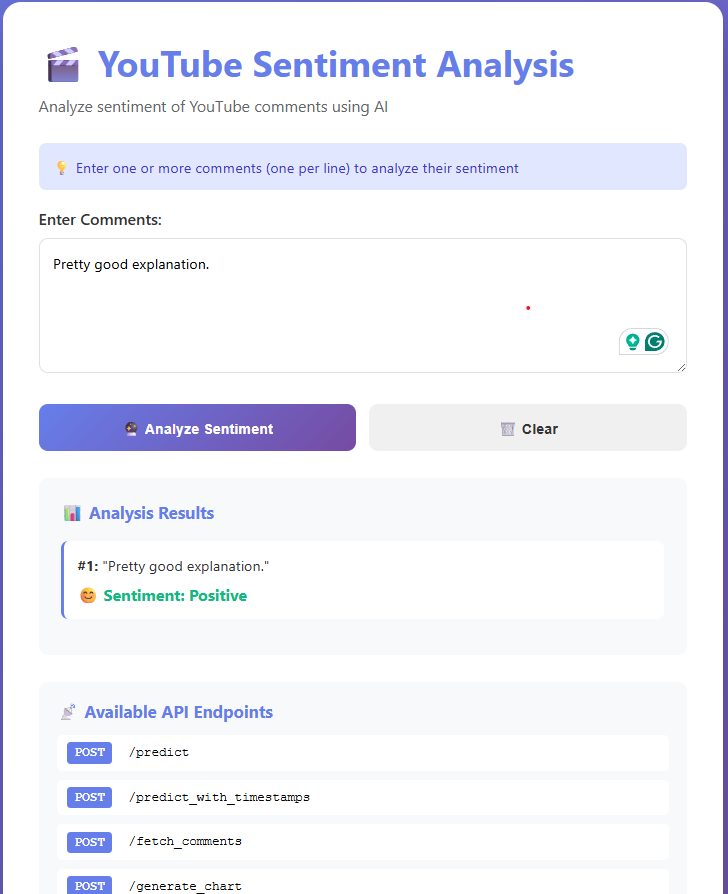
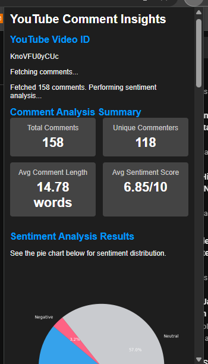

# 🎬 YouTube Sentiment Analysis - End-to-End ML Project


A complete end-to-end machine learning project 

    1.Webapplication: analyzes sentiment.

    2. A chorome extension to check how the video is on the basis of the comments given. It validate all the comments and provides the stat of them . 

Features automated CI/CD deployment to AWS.

# How to use chrome plugin--
 Download the folder "yt_chorome_plugin". Add the folder as an extension and open any youtube video to check the plugin.







## 📋 Table of Contents

- [Features](#-features)
- [Architecture](#-architecture)
- [Tech Stack](#-tech-stack)
- [Project Structure](#-project-structure)
- [Getting Started](#-getting-started)
  - [Prerequisites](#prerequisites)
  - [Local Setup](#local-setup)
  - [AWS Deployment](#aws-deployment)
- [Usage](#-usage)
  - [Chrome Extension](#chrome-extension)
  - [Web Interface](#web-interface)
  - [API Endpoints](#api-endpoints)
- [ML Pipeline](#-ml-pipeline)
- [CI/CD Pipeline](#-cicd-pipeline)
- [Model Information](#-model-information)
- [API Documentation](#-api-documentation)
- [Screenshots](#-screenshots)
- [Contributing](#-contributing)
- [License](#-license)

---

## ✨ Features

- **🎯 Sentiment Analysis**: Classify YouTube comments as Positive, Neutral, or Negative
- **🌐 Chrome Extension**: Analyze comments directly on YouTube with a single click
- **📊 Visualizations**: 
  - Pie charts for sentiment distribution
  - Word clouds from comments
  - Trend graphs showing sentiment over time
- **🖥️ Web Interface**: Beautiful web UI for testing the API
- **🔄 Real-time Analysis**: Fetch and analyze up to 500 comments per video
- **☁️ Cloud Deployment**: Fully deployed on AWS with automated CI/CD
- **📈 MLflow Integration**: Model tracking and versioning
- **🐳 Dockerized**: Containerized application for easy deployment
- **🔐 Secure**: API keys stored securely in GitHub Secrets

---

## 🏗️ Architecture

```
┌─────────────────┐
│  YouTube Video  │
└────────┬────────┘
         │
         ▼
┌─────────────────────────────────────────┐
│       Chrome Extension (Frontend)       │
│  • Extracts video ID                    │
│  • Displays results with visualizations │
└────────────┬────────────────────────────┘
             │
             ▼
┌─────────────────────────────────────────┐
│      Flask API (Backend - AWS EC2)      │
│  • /fetch_comments - Get YT comments    │
│  • /predict_with_timestamps - Analyze   │
│  • /generate_chart - Pie chart          │
│  • /generate_wordcloud - Word cloud     │
│  • /generate_trend_graph - Trends       │
└────────────┬────────────────────────────┘
             │
             ▼
┌─────────────────────────────────────────┐
│    LightGBM Model + TF-IDF Vectorizer   │
│  • Preprocesses comments (NLTK)         │
│  • Vectorizes text (TF-IDF)             │
│  • Predicts sentiment (-1, 0, 1)        │
└─────────────────────────────────────────┘
```

---

## 🛠️ Tech Stack

### **Machine Learning**
- **Model**: LightGBM Classifier
- **Feature Engineering**: TF-IDF Vectorization (trigrams)
- **Text Processing**: NLTK (stopwords, lemmatization)
- **Training Framework**: scikit-learn
- **Experiment Tracking**: MLflow

### **Backend**
- **Framework**: Flask 2.3.0
- **API**: RESTful API with CORS enabled
- **Visualization**: Matplotlib, WordCloud
- **Data Processing**: Pandas, NumPy

### **Frontend**
- **Chrome Extension**: Vanilla JavaScript
- **Web Interface**: HTML, CSS, JavaScript
- **YouTube API**: Google YouTube Data API v3

### **DevOps & Infrastructure**
- **Cloud Platform**: AWS (EC2, ECR, S3)
- **Containerization**: Docker
- **CI/CD**: GitHub Actions
- **Model Registry**: MLflow on AWS EC2
- **Version Control**: Git & GitHub

### **Development Tools**
- **Pipeline Orchestration**: DVC (Data Version Control)
- **Package Management**: pip, pipenv
- **Environment**: Python 3.10

---

## 📁 Project Structure

```
youtube-sentiment-insight-end-to-end/
│
├── .github/
│   └── workflows/
│       └── cicd.yaml              # GitHub Actions CI/CD pipeline
│
├── chrome-extension/
│   ├── manifest.json              # Extension configuration
│   ├── popup.html                 # Extension UI
│   └── popup.js                   # Extension logic
│
├── flask_api/
│   ├── main.py                    # Flask API server
│   └── templates/
│       └── index.html             # Web interface
│
├── src/
│   ├── data/
│   │   ├── data_ingestion.py      # Data loading and splitting
│   │   └── data_preprocessing.py  # Text preprocessing
│   └── model/
│       ├── model_building.py      # Model training
│       ├── model_evaluation.py    # Model evaluation & MLflow logging
│       └── register_model.py      # MLflow model registration
│
├── data/
│   ├── raw/                       # Raw data
│   └── interim/                   # Processed data
│
├── Dockerfile                     # Docker configuration
├── requirements.txt               # Python dependencies
├── params.yaml                    # Model hyperparameters
├── dvc.yaml                       # DVC pipeline definition
├── setup.py                       # Package setup
├── lgbm_model.pkl                 # Trained model
├── tfidf_vectorizer.pkl           # TF-IDF vectorizer
└── README.md                      # This file
```

---

## 🚀 Getting Started

### Prerequisites

- Python 3.10+
- Docker
- AWS Account (for deployment)
- Google Cloud Account (for YouTube API)
- Git

### Local Setup

1. **Clone the repository**
   ```bash
   git clone https://github.com/yourusername/youtube-sentiment-insight-end-to-end.git
   cd youtube-sentiment-insight-end-to-end
   ```

2. **Install dependencies**
   ```bash
   pip install -r requirements.txt
   ```

3. **Set up environment variables**
   ```bash
   export YOUTUBE_API_KEY='your_youtube_api_key'
   export AWS_ACCESS_KEY_ID='your_aws_access_key'
   export AWS_SECRET_ACCESS_KEY='your_aws_secret_key'
   export AWS_REGION='ap-southeast-2'
   ```

4. **Run the ML pipeline (optional - models are already trained)**
   ```bash
   dvc repro
   ```

5. **Run Flask API locally**
   ```bash
   cd flask_api
   python main.py
   ```
   
   Access at: `http://localhost:8080`

### AWS Deployment

#### **1. Set up MLflow Server on EC2**

```bash
# SSH into EC2
ssh -i your-key.pem ubuntu@your-ec2-ip

# Install dependencies
sudo apt update
sudo apt install python3-pip pipenv -y

# Set up MLflow
mkdir mlflow && cd mlflow
pipenv install mlflow awscli boto3
pipenv shell
aws configure

# Start MLflow as systemd service
sudo tee /etc/systemd/system/mlflow.service > /dev/null <<EOF
[Unit]
Description=MLflow Tracking Server
After=network.target

[Service]
Type=simple
User=ubuntu
WorkingDirectory=/home/ubuntu/mlflow
Environment="PATH=/home/ubuntu/.local/share/virtualenvs/mlflow-XXXXX/bin:/usr/local/bin:/usr/bin:/bin"
ExecStart=/home/ubuntu/.local/share/virtualenvs/mlflow-XXXXX/bin/mlflow server -h 0.0.0.0 --port 5000 --backend-store-uri sqlite:///mlflow.db --default-artifact-root s3://your-bucket
Restart=always
RestartSec=10

[Install]
WantedBy=multi-user.target
EOF

sudo systemctl daemon-reload
sudo systemctl enable mlflow
sudo systemctl start mlflow
```

#### **2. Configure GitHub Secrets**

Go to GitHub Repository → Settings → Secrets → Actions, and add:

| Secret Name | Description |
|------------|-------------|
| `AWS_ACCESS_KEY_ID` | Your AWS access key |
| `AWS_SECRET_ACCESS_KEY` | Your AWS secret key |
| `AWS_REGION` | AWS region (e.g., ap-southeast-2) |
| `AWS_ECR_LOGIN_URI` | Your ECR repository URI |
| `ECR_REPOSITORY_NAME` | ECR repository name |
| `YOUTUBE_API_KEY` | Google YouTube Data API key |

#### **3. Set up EC2 as Self-Hosted Runner**

```bash
# On EC2 instance
mkdir actions-runner && cd actions-runner
curl -o actions-runner-linux-x64-2.311.0.tar.gz -L https://github.com/actions/runner/releases/download/v2.311.0/actions-runner-linux-x64-2.311.0.tar.gz
tar xzf ./actions-runner-linux-x64-2.311.0.tar.gz

# Configure runner (get token from GitHub)
./config.sh --url https://github.com/yourusername/yourrepo --token YOUR_TOKEN

# Install as service
sudo ./svc.sh install
sudo ./svc.sh start
```

#### **4. Configure EC2 Security Groups**

Add inbound rules:
- Port 22 (SSH)
- Port 5000 (MLflow UI)
- Port 8080 (Flask API)

#### **5. Allocate Elastic IP**

1. AWS Console → EC2 → Elastic IPs
2. Allocate Elastic IP address
3. Associate with your EC2 instance

#### **6. Deploy**

Simply push to main branch:
```bash
git add .
git commit -m "your message"
git push origin main
```

GitHub Actions will automatically:
- Build Docker image
- Push to ECR
- Deploy to EC2
- Start the container

---

## 💡 Usage

### Chrome Extension

1. **Load the extension**
   - Open Chrome → `chrome://extensions/`
   - Enable "Developer mode"
   - Click "Load unpacked"
   - Select the `chrome-extension` folder

2. **Update API URL**
   - Edit `chrome-extension/popup.js`
   - Set `API_URL` to your EC2 Elastic IP:
   ```javascript
   const API_URL = 'http://YOUR_ELASTIC_IP:8080/';
   ```

3. **Use the extension**
   - Go to any YouTube video
   - Click the extension icon
   - View sentiment analysis results!

### Web Interface

Visit: `http://YOUR_ELASTIC_IP:8080/`

Features:
- Enter multiple comments (one per line)
- Click "Analyze Sentiment"
- View results with sentiment indicators
- See API endpoint documentation

### API Endpoints

#### **POST /predict**
Predict sentiment for comments

**Request:**
```json
{
  "comments": ["This is amazing!", "I don't like this"]
}
```

**Response:**
```json
[
  {"comment": "This is amazing!", "sentiment": 1},
  {"comment": "I don't like this", "sentiment": -1}
]
```

#### **POST /fetch_comments**
Fetch YouTube comments server-side

**Request:**
```json
{
  "video_id": "dQw4w9WgXcQ"
}
```

**Response:**
```json
{
  "comments": [
    {
      "text": "Great video!",
      "timestamp": "2024-01-01T12:00:00Z",
      "authorId": "UCxxxxx"
    }
  ]
}
```

#### **POST /generate_chart**
Generate sentiment distribution pie chart

**Request:**
```json
{
  "sentiment_counts": {
    "1": 150,
    "0": 50,
    "-1": 30
  }
}
```

**Response:** PNG image

#### **POST /generate_wordcloud**
Generate word cloud from comments

**Request:**
```json
{
  "comments": ["comment1", "comment2", "..."]
}
```

**Response:** PNG image

#### **POST /generate_trend_graph**
Generate sentiment trend over time

**Request:**
```json
{
  "sentiment_data": [
    {"timestamp": "2024-01-01T12:00:00Z", "sentiment": 1},
    {"timestamp": "2024-01-02T12:00:00Z", "sentiment": -1}
  ]
}
```

**Response:** PNG image

---

## 🧪 ML Pipeline

### Pipeline Stages (DVC)

1. **Data Ingestion** (`src/data/data_ingestion.py`)
   - Load dataset from GitHub
   - Split into train/test (80/20)
   - Handle missing values and duplicates

2. **Data Preprocessing** (`src/data/data_preprocessing.py`)
   - Lowercase conversion
   - Remove special characters
   - Remove stopwords (retain sentiment-related words)
   - Lemmatization

3. **Model Building** (`src/model/model_building.py`)
   - TF-IDF vectorization (trigrams, max 1000 features)
   - Train LightGBM classifier
   - Hyperparameters from `params.yaml`

4. **Model Evaluation** (`src/model/model_evaluation.py`)
   - Evaluate on test set
   - Log metrics to MLflow
   - Generate confusion matrix
   - Save model artifacts

5. **Model Registration** (`src/model/register_model.py`)
   - Register model in MLflow Model Registry
   - Transition to "Staging"

### Run Pipeline

```bash
dvc repro
```

### Hyperparameters

Edit `params.yaml`:
```yaml
data_ingestion:
  test_size: 0.20

model_building:
  ngram_range: [1, 3]
  max_features: 1000
  learning_rate: 0.09
  max_depth: 20
  n_estimators: 367
```

---

## 🔄 CI/CD Pipeline

### Workflow Stages

1. **Continuous Integration**
   - Lint code
   - Run unit tests

2. **Continuous Delivery**
   - Build Docker image
   - Push to Amazon ECR

3. **Continuous Deployment**
   - Pull latest image from ECR
   - Stop old container
   - Start new container
   - Clean up old images

### Trigger

Push to `main` branch:
```bash
git push origin main
```

---

## 🤖 Model Information

- **Algorithm**: LightGBM (Gradient Boosting)
- **Task**: Multi-class classification (3 classes)
- **Classes**: 
  - `-1`: Negative sentiment
  - `0`: Neutral sentiment  
  - `1`: Positive sentiment
- **Features**: TF-IDF vectors (max 1000 features, trigrams)
- **Dataset**: Reddit comments (sentiment-labeled)
- **Metrics**: Classification report, Confusion matrix
- **Version Control**: MLflow Model Registry

---

## 📚 API Documentation

### Authentication
No authentication required (for now)

### Rate Limiting
- YouTube API: 10,000 units/day (Google quota)
- Flask API: No limit (consider adding for production)

### Error Handling

All endpoints return standard error format:
```json
{
  "error": "Error message here"
}
```

HTTP Status Codes:
- `200`: Success
- `400`: Bad Request (missing parameters)
- `405`: Method Not Allowed (wrong HTTP method)
- `500`: Internal Server Error

---

## 📸 Screenshots

### Chrome Extension


### Web Interface


### Sentiment Distribution


### Word Cloud


### Sentiment Trends


---

## 🤝 Contributing

Contributions are welcome! Please follow these steps:

1. Fork the repository
2. Create a feature branch (`git checkout -b feature/AmazingFeature`)
3. Commit your changes (`git commit -m 'Add some AmazingFeature'`)
4. Push to the branch (`git push origin feature/AmazingFeature`)
5. Open a Pull Request

---

## 📝 License

This project is licensed under the MIT License - see the [LICENSE](LICENSE) file for details.

---

## 👨‍💻 Author

**Banibrata Ghosh**
- Email: banibrataghosh916@gmail.com
- GitHub: [@yourusername](https://github.com/yourusername)

---

## 🙏 Acknowledgments

- Reddit dataset for sentiment analysis
- Google YouTube Data API
- MLflow for experiment tracking
- AWS for cloud infrastructure
- OpenAI for development assistance

---

## 📞 Support

For issues and questions:
- Open an issue on GitHub
- Email: banibrataghosh916@gmail.com

---

## 🔮 Future Enhancements

- [ ] Add user authentication
- [ ] Implement rate limiting
- [ ] Add support for more languages
- [ ] Real-time sentiment analysis
- [ ] Deploy to AWS ECS/Kubernetes
- [ ] Add A/B testing for models
- [ ] Create mobile app
- [ ] Add sentiment analysis for video titles/descriptions
- [ ] Implement caching for repeated queries
- [ ] Add analytics dashboard

---

**⭐ If you found this project helpful, please give it a star!**